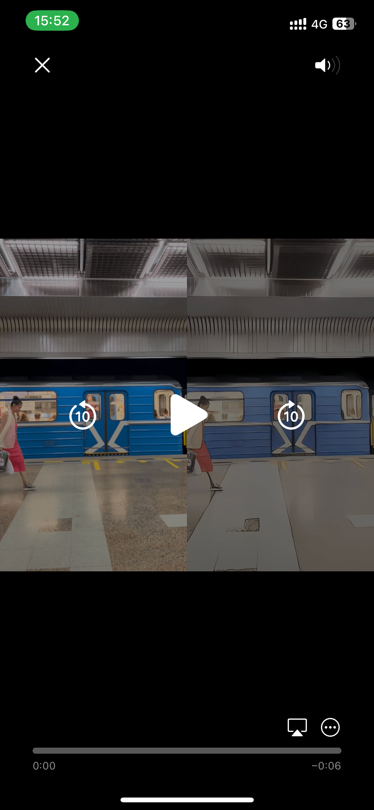
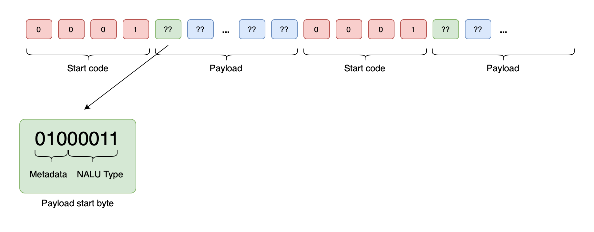
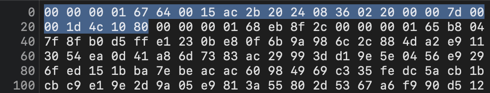
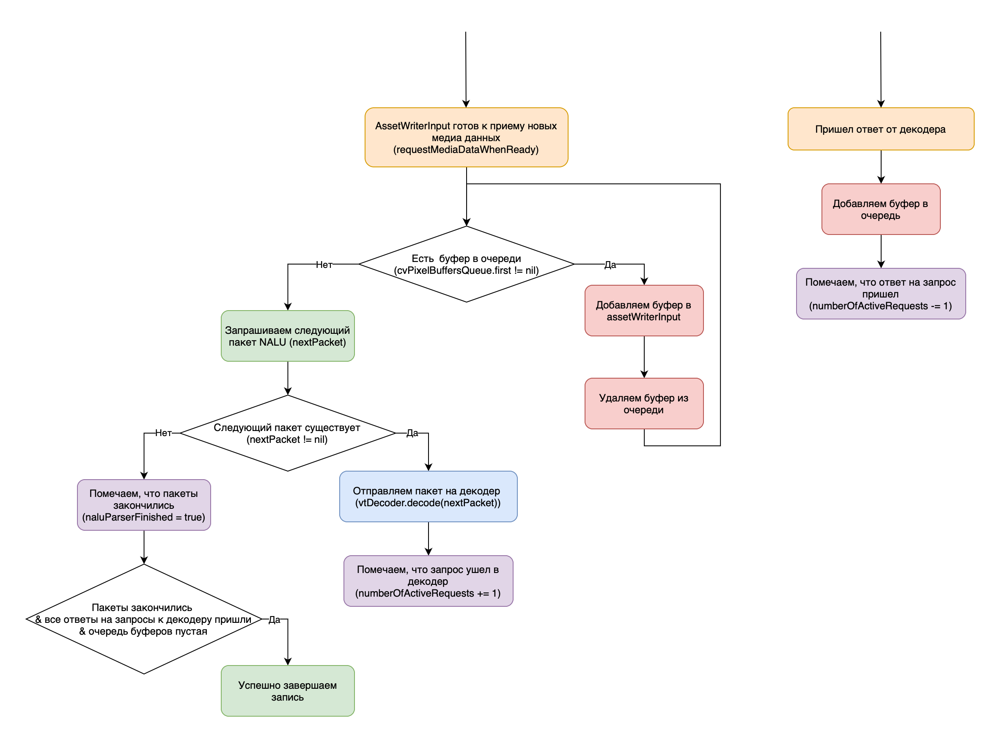

# Демо приложение перепаковки h264 стрима в mp4 контейнер

Демо приложение, которое показывает как произвести конвертацию h264 AnexB стрима в файл.

  

* Результат работы приложения (слева оригинальное видео, справа декодированный h264 стрим в видео контейнер)

## Типы h264 стримов

Не существует единого стандарта h264 стрима. В нашем случае будем рассматривать `AnexB` формат, как самый популярный.

## Как устроен h264 стрим

Стрим устроен следующим образом:

- Весь стрим разбит на отдельные пакеты, которые называются NALU (Network Abstraction Layer Unit).
- На первом месте идет стартовый бит (3 или 4 байта). Важно понимать, что посколько данный бит разделяет NALU пакеты между собой, в последовательности бит внутри пакета не должно содержаться такой последовательности (а так же последовательности `0x00000000`, `0x00000001`, `0x00000002`, `0x00000003`). Для этого используется `Байт предотвращения коллизии` (`Emulation Prevention Byte`) - байт `0x03` вставляется между третьим и четвертым байтом конфликтной последовательности (`0x00000001` становится `0x0000000301`).
- После стартового бита начинается полезная нагрузка пакета. Поскольку пакеты бывают разных типов, в первом байте закодирована информация о данном пакете. В первых трех битах мета информация для декодировщика, следующие 5 бит отвечают за тип пакета.

Для задачи remux (переупаковка без декодинга/енкодинга медиа) необходимо произвести разбор стрима на NALU пакеты и затем с помощью `AVAssetWriter` создать видеофайл.

Пример стрима:

- Данный стрим использует 4 байта на стартовый код. 
- Выделен первый пакет и для первого пакета информация содержится в байте `0x67` (`0x01100111`) - `0x011` мета информация для декодировщика + `0x00111` (7) тип пакета (SPS - Sequence parameter set).

## Avcc атом

> An H.264 AVCConfigurationBox

Нужен для правильного понимания h264 кодека внутри контейнера. Стандартный метод `CMVideoFormatDescriptionCreateFromH264ParameterSets` не создает такого атома, поэтому лучше всего его создать вручную.

Формат данных описан в ISO/IEC 14496-15:2004(E), Section 5.2.4.1. Источник приведен ниже. В коде за это отвечает сущность `AVCCExtractor`.

## Подход

Сначала хотели использовать подход с remux (перепаковка без декодинга) видеопотока. Однако в процессе реализации был получен выходной mp4 контейнер с проблемной перемоткой (было ощущение, что не хватает ключевых кадров). Починить это не получилось. 

После этого, был выбран rip подход (перепаковка с декодингом). Декодинг происходит с помощью `VideoToolbox` фреймворка, после чего кадры упаковываются через `AVAssetWriter`.

## Ресурсы для изучения h264 стрима и работы с ним

- [Коммент на SO про устройство h264 стрима](https://stackoverflow.com/questions/24884827/possible-locations-for-sequence-picture-parameter-sets-for-h-264-stream/24890903#24890903)
- [PDF документ про устройство h264 стрима](http://guoh.org/lifelog/wp-content/uploads/2013/10/Exploring-H.264.-Part-2-H.264-Bitstream-format.pdf)
- [Коммент на SO про то, как перепаковывать h264 стрим в iOS без декодинга (текстом)](https://stackoverflow.com/questions/29972330/how-to-wrap-an-h-264-file-as-mp4-on-ios)
- [Коммент на SO про то, как перепаковывать h264 стрим в iOS без декодинга (с примером кода)](https://stackoverflow.com/questions/15629117/using-avassetwriter-with-raw-nal-units)
- [Коммент на SO про устройство avcc атома в mp4](https://stackoverflow.com/questions/15673379/avassetwriterinput-h-264-passthrough-to-quicktime-mov-passing-in-sps-pps-to/)
- [CLI для анализа mp4 контейнера (dump, info и другие)](http://www.bento4.com)
- [(Сайт Apple) WWDC 2014 513 - Direct access to media decoding and encoding](https://developer.apple.com/videos/play/wwdc2014/513/)
- [(Скачивание видео) WWDC 2013 606 - Moving to AVKit and AVFoundation (интересно про AVAssetWriter/Reader)](https://devstreaming-cdn.apple.com/videos/wwdc/2013/606xdx2xbp31zp28fdov8p0b6d/606/606-HD.mov?dl=1)
- [(Скачивание видео) WWDC 2011 415 - Working with Media in AV Foundation](https://developer.apple.com/devcenter/download.action?path=/videos/wwdc_2011__hd/session_415__working_with_media_in_av_foundation.m4v)

## Работа конвертера

